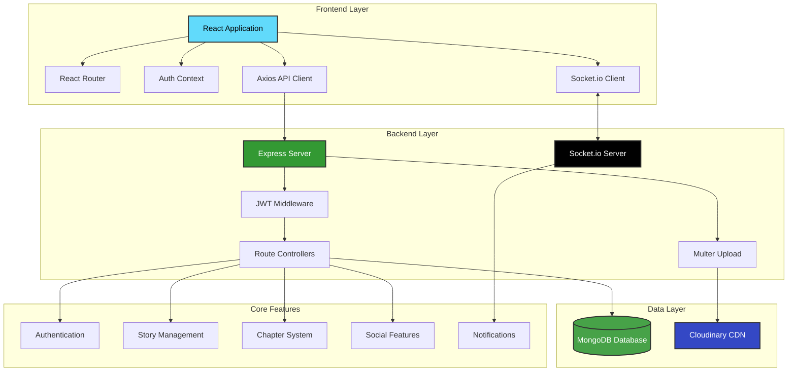
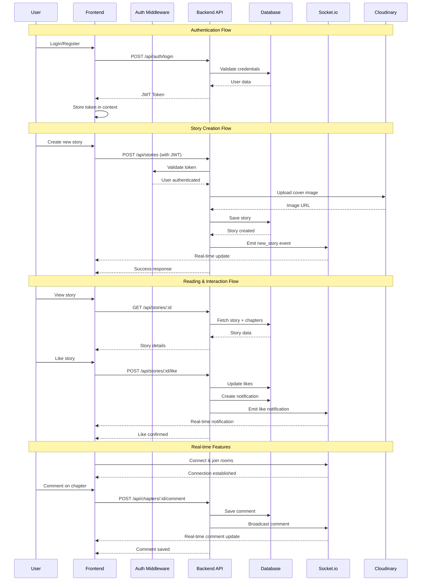
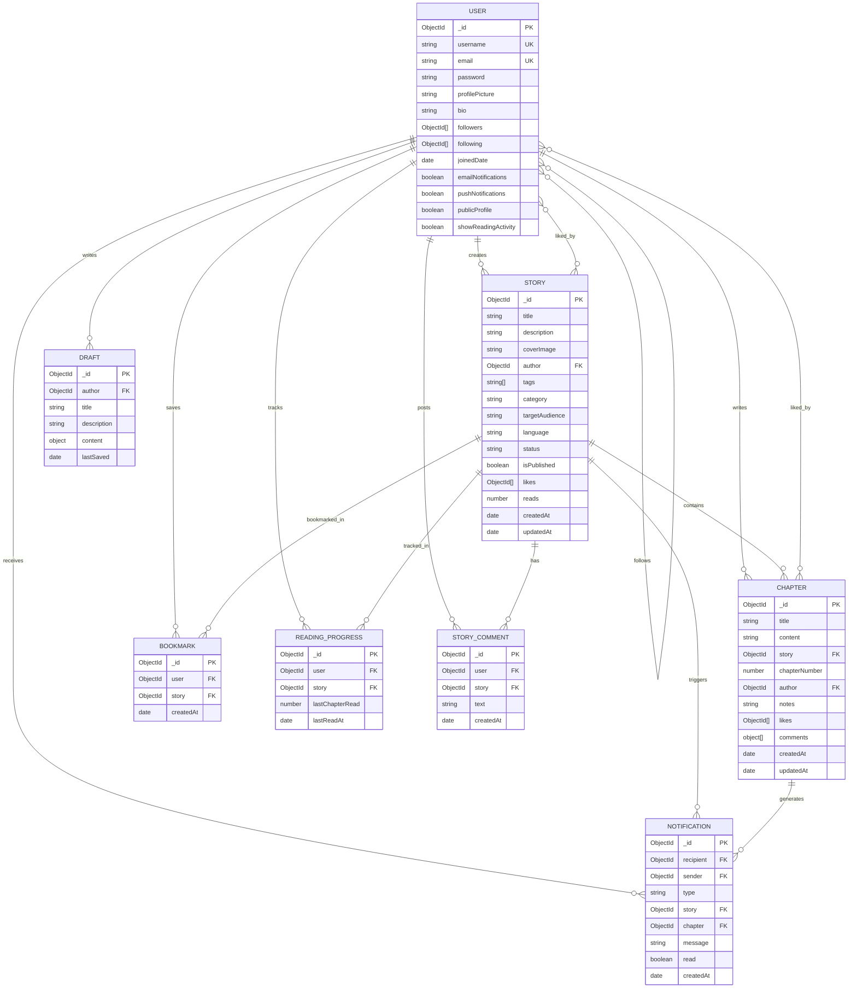

<div align="center">

# 📚 StoryPad - Where Stories Begin


**A creative storytelling platform where writers share their stories and connect with readers worldwide**

[Features](#-features) • [Tech Stack](#-tech-stack) • [Architecture](#-architecture) • [Getting Started](#-getting-started) • [API Documentation](#-api-endpoints)

</div>

---

## 📖 Overview

StoryPad is a modern, full-stack web application designed for creative writers and avid readers. It provides a seamless platform for authors to publish their stories chapter by chapter, while readers can discover, bookmark, and engage with content in real-time. The platform features a social networking aspect where users can follow their favorite authors, receive notifications, and track their reading progress.

---

## ✨ Features

### 👤 **User Management & Authentication**

<table>
<tr>
<td width="50%">

#### Authentication System
- 🔐 **Secure Registration & Login** - JWT-based authentication with bcrypt password hashing
- 🔑 **Token-based Authorization** - Protected routes with middleware validation
- 👥 **User Profiles** - Customizable profiles with bio and profile pictures
- 📸 **Avatar Upload** - Cloudinary integration for profile picture management

</td>
<td width="50%">

#### Social Features
- 👫 **Follow System** - Follow/unfollow other writers and readers
- 📊 **Public/Private Profiles** - Control profile visibility
- 🎯 **Activity Tracking** - Optional reading activity display
- ⚙️ **Account Settings** - Manage email and push notification preferences

</td>
</tr>
</table>

### 📚 **Story Management**

<table>
<tr>
<td width="50%">

#### Story Creation & Editing
- ✍️ **Rich Story Editor** - Create and edit stories with detailed metadata
- 🖼️ **Cover Image Upload** - Custom cover images via Cloudinary
- 🏷️ **Categorization** - Multiple categories and custom tags
- 📝 **Story Metadata**:
  - Title and description
  - Category selection
  - Target audience specification
  - Language settings
  - Status tracking (Ongoing/Completed/Hiatus)
  - Publication control

</td>
<td width="50%">

#### Chapter Management
- 📖 **Multi-Chapter Support** - Organize stories into sequential chapters
- 📄 **Chapter Editor** - Rich text editing for chapter content
- 🔢 **Auto-numbering** - Automatic chapter number assignment
- 📝 **Author Notes** - Add notes to each chapter
- 💬 **Chapter Comments** - Reader engagement on specific chapters
- ❤️ **Chapter Likes** - Individual chapter appreciation

</td>
</tr>
</table>

### 📖 **Reading Experience**

<table>
<tr>
<td width="50%">

#### Discovery & Browse
- 🌟 **Story Feed** - Discover new and trending stories
- 🔍 **Search Functionality**:
  - Search stories by title, tags, or category
  - Search users by username
- 🎯 **Filter Options**:
  - Category filtering
  - Status filtering
  - Tag-based filtering
- 📊 **Sorting Options**:
  - Latest updates
  - Most popular (by reads)
  - Trending stories

</td>
<td width="50%">

#### Reading Features
- 📚 **Chapter Reader** - Clean, distraction-free reading interface
- 📍 **Reading Progress** - Automatic progress tracking
- 🔖 **Bookmarks** - Save favorite stories for later
- 👁️ **View Counter** - Track story popularity
- ⏱️ **Reading History** - Track your reading journey
- 📱 **Responsive Design** - Optimized for all devices

</td>
</tr>
</table>

### 💬 **Social Interaction**

<table>
<tr>
<td width="50%">

#### Engagement Features
- ❤️ **Like System**:
  - Like stories
  - Like individual chapters
- 💬 **Comments**:
  - Comment on stories
  - Comment on chapters
- 🔔 **Real-time Notifications**:
  - Story likes
  - Chapter likes
  - New comments
  - New followers
  - New chapter publications

</td>
<td width="50%">

#### Community Features
- 👥 **Author Profiles** - View author portfolios
- 📈 **Story Statistics**:
  - Total reads counter
  - Likes count
  - Comments count
  - Chapter count
- 🌐 **Social Sharing** - Share stories with the community
- 🔄 **Real-time Updates** - Socket.io powered live updates

</td>
</tr>
</table>

### 📝 **Draft System**

- 💾 **Auto-save Drafts** - Automatic draft saving for stories
- 📋 **Draft Management** - Save and resume writing later
- ✏️ **Draft Recovery** - Never lose your work with auto-save functionality
- 🔄 **Draft to Published** - Seamless conversion from draft to published story

### 🔔 **Notification System**

<table>
<tr>
<td width="33%">

#### Notification Types
- ❤️ Story likes
- 📖 Chapter likes
- 💬 Story comments
- 📝 Chapter comments
- 👥 New followers
- 📚 New chapter alerts

</td>
<td width="33%">

#### Features
- 🔴 Unread indicators
- ✅ Mark as read
- 📱 Real-time delivery
- 🔕 Notification preferences

</td>
<td width="33%">

#### Management
- 📬 Notification center
- 🧹 Bulk actions
- ⚙️ Settings control
- 🔔 Email & push options

</td>
</tr>
</table>

---

## 🛠️ Tech Stack

### **Frontend Technologies**

<table>
<tr>
<td align="center" width="20%">
<br>
<sub><b>React 19.1.1</b></sub><br>
<sub>Core UI library with latest features</sub>
</td>
<td align="center" width="20%">
<br>
<sub><b>Vite 7.1.7</b></sub><br>
<sub>Fast build tool & dev server</sub>
</td>
<td align="center" width="20%">
<br>
<sub><b>Tailwind CSS 4.1.16</b></sub><br>
<sub>Utility-first CSS framework</sub>
</td>
<td align="center" width="20%">
<br>
<sub><b>React Router 7.9.5</b></sub><br>
<sub>Client-side routing</sub>
</td>
<td align="center" width="20%">
<br>
<sub><b>Axios 1.13.1</b></sub><br>
<sub>HTTP client</sub>
</td>
</tr>
</table>

#### Additional Frontend Libraries

- **Socket.io Client (4.8.1)** - Real-time bidirectional communication
- **Lucide React (0.552.0)** - Beautiful, consistent icon set
- **React Toastify (11.0.5)** - Toast notifications
- **React Hot Toast (2.6.0)** - Alternative toast system
- **Tailwind Plugins**:
  - `@tailwindcss/typography` - Beautiful typographic defaults
  - `@tailwindcss/forms` - Form styling utilities
- **Class Variance Authority (0.7.1)** - Type-safe component variants
- **clsx (2.1.1)** - Conditional className utility

### **Backend Technologies**

<table>
<tr>
<td align="center" width="20%">
<br>
<sub><b>Express 5.1.0</b></sub><br>
<sub>Fast web framework</sub>
</td>
<td align="center" width="20%">
<br>
<sub><b>Mongoose 8.19.2</b></sub><br>
<sub>MongoDB ODM</sub>
</td>
<td align="center" width="20%">
<br>
<sub><b>Socket.io 4.8.1</b></sub><br>
<sub>Real-time engine</sub>
</td>
<td align="center" width="20%">
<br>
<sub><b>JWT 9.0.2</b></sub><br>
<sub>Authentication tokens</sub>
</td>
<td align="center" width="20%">
<br>
<sub><b>Cloudinary 1.41.3</b></sub><br>
<sub>Image management</sub>
</td>
</tr>
</table>

#### Additional Backend Libraries

- **bcryptjs (3.0.3)** - Password hashing and security
- **cors (2.8.5)** - Cross-Origin Resource Sharing
- **dotenv (17.2.3)** - Environment variable management
- **multer (2.0.2)** - File upload handling
- **multer-storage-cloudinary (4.0.0)** - Cloudinary storage engine for Multer
- **nodemon (3.1.10)** - Development auto-reload

### **Database Schema**

#### 📊 **8 Data Models**

1. **User Model** - User profiles, authentication, preferences
2. **Story Model** - Story metadata, author, stats, publication status
3. **Chapter Model** - Chapter content, ordering, comments, likes
4. **Bookmark Model** - User bookmarks for stories
5. **Notification Model** - User notifications and alerts
6. **ReadingProgress Model** - Track reading position per user
7. **StoryComment Model** - Comments on stories
8. **Draft Model** - Auto-saved story drafts

---

## 🏗️ Architecture

### **System Architecture Flow**



### **Application Flow**



### **Data Model Relationships**



---

## 🚀 Getting Started

### **Prerequisites**

- Node.js (v16 or higher)
- MongoDB (local installation or MongoDB Atlas account)
- Cloudinary account (for image uploads)
- npm or yarn package manager

### **Environment Variables**

#### Backend (.env)
```bash
# Server Configuration
PORT=5000
NODE_ENV=development

# Database
MONGODB_URI=mongodb://localhost:27017/storypad
# OR MongoDB Atlas
# MONGODB_URI=mongodb+srv://<username>:<password>@cluster.mongodb.net/storypad

# JWT Secret
JWT_SECRET=your_super_secret_jwt_key_here

# Cloudinary Configuration
CLOUDINARY_CLOUD_NAME=your_cloud_name
CLOUDINARY_API_KEY=your_api_key
CLOUDINARY_API_SECRET=your_api_secret

# Client URL (for CORS)
CLIENT_URL=http://localhost:5173
```

#### Frontend (.env)
```bash
# API Base URL
VITE_API_URL=http://localhost:5000/api
VITE_SOCKET_URL=http://localhost:5000
```

### **Installation Steps**

#### 1️⃣ Clone the Repository
```bash
git clone https://github.com/yourusername/storypad.git
cd storypad
```

#### 2️⃣ Install Backend Dependencies
```bash
cd backend
npm install
```

#### 3️⃣ Install Frontend Dependencies
```bash
cd ../frontend
npm install
```

#### 4️⃣ Configure Environment Variables
```bash
# Create .env files in both backend and frontend directories
# Copy the environment variables from the examples above
```

#### 5️⃣ Start MongoDB
```bash
# If using local MongoDB
mongod

# If using MongoDB Atlas, ensure your connection string is in backend/.env
```

#### 6️⃣ Start the Backend Server
```bash
cd backend
npm run dev
# Server will start on http://localhost:5000
```

#### 7️⃣ Start the Frontend Development Server
```bash
cd frontend
npm run dev
# Application will start on http://localhost:5173
```

#### 8️⃣ Open Your Browser
Navigate to `http://localhost:5173` and start exploring StoryPad!

---

## 📡 API Endpoints

### **Authentication Routes** (`/api/auth`)

| Method | Endpoint | Description | Auth Required |
|--------|----------|-------------|---------------|
| POST | `/register` | Register a new user | ❌ |
| POST | `/login` | Login user and get JWT token | ❌ |

### **User Routes** (`/api/users`)

| Method | Endpoint | Description | Auth Required |
|--------|----------|-------------|---------------|
| GET | `/:userId` | Get user profile by ID | ✅ |
| PUT | `/profile` | Update user profile | ✅ |
| PUT | `/profile-picture` | Update profile picture | ✅ |
| POST | `/:userId/follow` | Follow/unfollow a user | ✅ |
| GET | `/search` | Search users by username | ✅ |
| GET | `/:userId/followers` | Get user's followers | ✅ |
| GET | `/:userId/following` | Get users being followed | ✅ |

### **Story Routes** (`/api/stories`)

| Method | Endpoint | Description | Auth Required |
|--------|----------|-------------|---------------|
| GET | `/` | Get all published stories (with filters) | ✅ |
| GET | `/:storyId` | Get story details by ID | ✅ |
| POST | `/` | Create a new story | ✅ |
| PUT | `/:storyId` | Update story | ✅ |
| DELETE | `/:storyId` | Delete story | ✅ |
| POST | `/:storyId/like` | Like/unlike a story | ✅ |
| GET | `/:storyId/chapters` | Get all chapters of a story | ✅ |
| GET | `/user/:userId` | Get stories by user | ✅ |
| GET | `/search` | Search stories | ✅ |

### **Chapter Routes** (`/api/chapters`)

| Method | Endpoint | Description | Auth Required |
|--------|----------|-------------|---------------|
| GET | `/:chapterId` | Get chapter by ID | ✅ |
| POST | `/` | Create a new chapter | ✅ |
| PUT | `/:chapterId` | Update chapter | ✅ |
| DELETE | `/:chapterId` | Delete chapter | ✅ |
| POST | `/:chapterId/like` | Like/unlike a chapter | ✅ |
| POST | `/:chapterId/comment` | Add comment to chapter | ✅ |
| GET | `/story/:storyId` | Get all chapters of a story | ✅ |

### **Bookmark Routes** (`/api/bookmarks`)

| Method | Endpoint | Description | Auth Required |
|--------|----------|-------------|---------------|
| GET | `/` | Get user's bookmarks | ✅ |
| POST | `/:storyId` | Add/remove bookmark | ✅ |
| GET | `/check/:storyId` | Check if story is bookmarked | ✅ |

### **Notification Routes** (`/api/notifications`)

| Method | Endpoint | Description | Auth Required |
|--------|----------|-------------|---------------|
| GET | `/` | Get user's notifications | ✅ |
| PUT | `/:notificationId/read` | Mark notification as read | ✅ |
| DELETE | `/:notificationId` | Delete notification | ✅ |
| GET | `/unread-count` | Get unread notifications count | ✅ |
| PUT | `/mark-all-read` | Mark all notifications as read | ✅ |

### **Reading Progress Routes** (`/api/reading-progress`)

| Method | Endpoint | Description | Auth Required |
|--------|----------|-------------|---------------|
| GET | `/story/:storyId` | Get reading progress for a story | ✅ |
| POST | `/` | Update reading progress | ✅ |

### **Story Comments Routes** (`/api/story-comments`)

| Method | Endpoint | Description | Auth Required |
|--------|----------|-------------|---------------|
| GET | `/story/:storyId` | Get comments for a story | ✅ |
| POST | `/` | Add comment to a story | ✅ |
| DELETE | `/:commentId` | Delete a comment | ✅ |

### **Draft Routes** (`/api/drafts`)

| Method | Endpoint | Description | Auth Required |
|--------|----------|-------------|---------------|
| GET | `/` | Get user's drafts | ✅ |
| POST | `/` | Save/update draft | ✅ |
| GET | `/:draftId` | Get specific draft | ✅ |
| DELETE | `/:draftId` | Delete draft | ✅ |

---

## 🎨 Key Features in Detail

### **Real-time Communication**

StoryPad uses Socket.io to provide real-time updates across the platform:

- **Instant Notifications**: Users receive immediate notifications for likes, comments, and follows
- **Live Feed Updates**: New stories appear in feeds without page refresh
- **Real-time Engagement**: Comments and likes update instantly for all viewers
- **Connection Rooms**: Users join specific rooms for targeted updates (feed room, story rooms, user rooms)

### **Advanced Search & Discovery**

- **Multi-parameter Search**: Search stories by title, tags, category, and author
- **User Discovery**: Find and follow other writers and readers
- **Smart Filtering**: Filter by category, status, and publication state
- **Trending Algorithm**: Stories ranked by recent activity and engagement
- **Personalized Feed**: Content based on followed authors and reading history

### **Rich Text Editing**

- **Story Composition**: Detailed story creation with metadata
- **Chapter Writing**: Full-featured chapter editor
- **Auto-save**: Drafts automatically saved to prevent data loss
- **Author Notes**: Add context and notes to chapters

### **Performance Optimizations**

- **Database Indexing**: Optimized MongoDB indexes for fast queries
- **Lazy Loading**: Efficient pagination for stories and chapters
- **Image Optimization**: Cloudinary CDN for fast image delivery
- **Caching**: Strategic caching of frequently accessed data

---

## 📱 Responsive Design

StoryPad is fully responsive and optimized for:

- 💻 **Desktop** - Full-featured experience
- 📱 **Tablet** - Touch-optimized interface
- 📱 **Mobile** - Mobile-first design principles
- 🌙 **All Screen Sizes** - Adaptive layouts with Tailwind CSS

---

## 🔒 Security Features

- **JWT Authentication** - Secure token-based authentication
- **Password Hashing** - bcryptjs encryption for user passwords
- **Protected Routes** - Middleware-based route protection
- **CORS Configuration** - Controlled cross-origin requests
- **Input Validation** - Server-side validation for all inputs
- **Environment Variables** - Sensitive data stored securely

---

## 🎯 Future Enhancements

While StoryPad already offers a comprehensive feature set, potential future enhancements could include:

- Advanced content moderation
- Premium subscription tiers
- Story analytics dashboard
- Mobile app (iOS/Android)
- Multi-language support
- Story export (PDF, EPUB)
- Advanced search filters
- Reading streaks and achievements
- Writing challenges and contests

---

## 📄 License

This project is licensed under the ISC License.

---

## 👥 Authors

**StoryPad Team**

For questions or support, please contact: team@storypad.com

---

## 🙏 Acknowledgments

- React team for the amazing framework
- MongoDB for the flexible database
- Socket.io for real-time capabilities
- Cloudinary for image management
- Tailwind CSS for beautiful styling
- All contributors and users of StoryPad

---

<div align="center">

### ⭐ Star this repository if you find it helpful!

**Made with ❤️ by the StoryPad Team**

</div>
